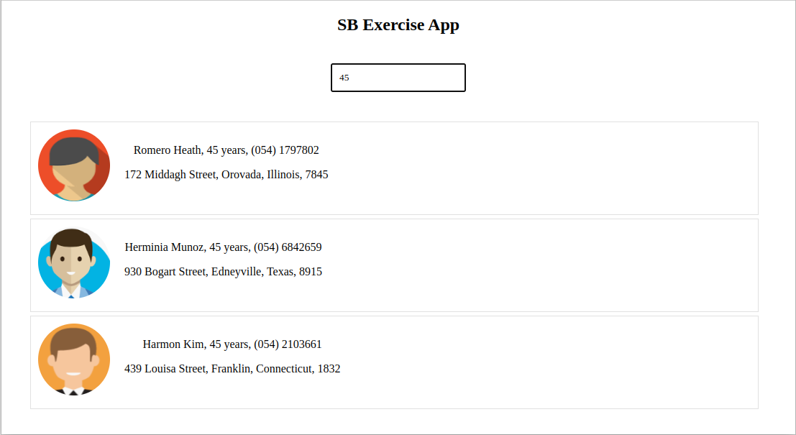
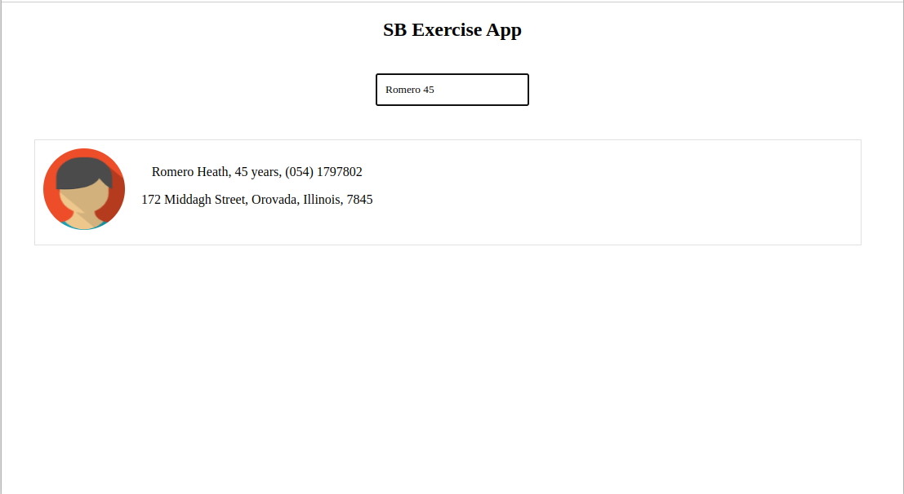

# SB GraphQL Client (Exercise)

This is a project exercise for SB . The goal was to build a simple React App Client. This project was bootstrapped with [Create React App](https://github.com/facebook/create-react-app).

# Setup on Terminal and Run App Locally

```terminal
git clone https://github.com/felipeeu/sb_exercise_client.git
cd sb_exercise_client
npm install
npm start
```

# Running

Open your browser and type `http://localhost:3000`

# Demo

## Looking for contacts who are 45 years old



## Looking for contacts who are 45 years old called Romero

)

## Used packages

- [React](https://reactjs.org/)
- [Recoil](https://recoiljs.org/)
- [Moment](https://momentjs.com/)
- [GraphQL-hooks](https://github.com/nearform/graphql-hooks)

## License

MIT
